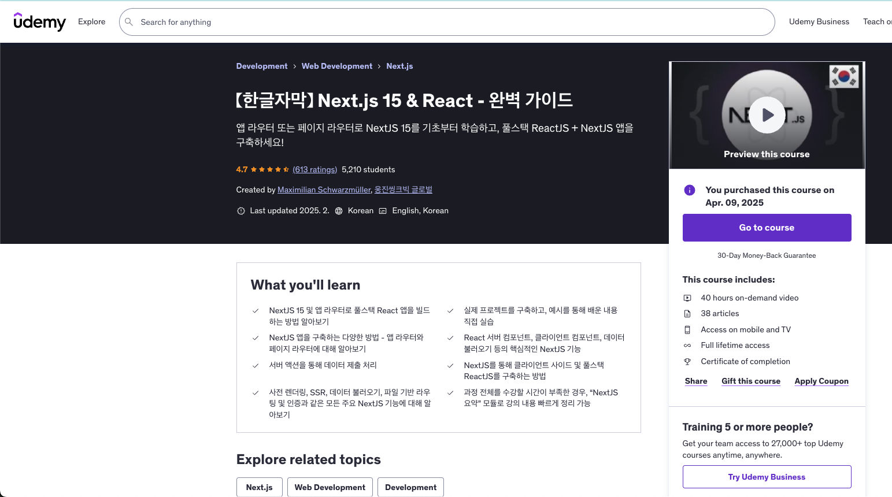

프론트엔드 개발을 공부하며 나는 리액트(React)에 대한 학습을 어느 정도 진행한 상태였다.  
하지만 **Next.js는 처음 접하는 입문자**로서, 단순히 문서를 읽거나 블로그를 보는 것보다 제대로 된 커리큘럼이 있는 강의가 필요했다.

그래서 선택한 것이 바로 아래의 강의다.

📚 추천 강의: [Next.js & React - The Complete Guide (incl. Two Paths!)](https://www.udemy.com/course/nextjs-react-incl-two-paths/)

이 강의를 통해 **Next.js를 활용한 풀스택 React 프로젝트를 직접 구현해보는 것**이 이번 공부의 목표다.  
공부를 진행하면서 배우는 **개념, 원리, 핵심 정보들**을 정리하여 이 블로그에 시리즈로 남기려 한다.

---

## 🧭 Next.js란 무엇인가?

Next.js는 **리액트(React) 기반의 프레임워크**다. 정확히 말하면 **리액트 위에 빌드된 풀스택 프레임워크**다. 리액트 자체는 UI 구축을 위한 라이브러리이기 때문에, 애플리케이션의 완전한 구성 요소(예: 라우팅, 데이터 페칭, 인증, 서버 처리 등)를 모두 자체적으로 제공하진 않는다.

그래서 등장한 것이 Next.js다. 리액트를 기반으로 하되, 클라이언트뿐만 아니라 서버 기능까지 통합하여 **풀스택 애플리케이션을 쉽게 만들 수 있는 도구**다.

---

## 🌍 왜 Next.js를 사용하는가?

최근 몇 년 사이, 프론트엔드 개발은 단순한 클라이언트 렌더링을 넘어서 **풀스택 애플리케이션**으로 진화해왔다. 사용자 인증, 데이터베이스 연동, 서버 처리 등 다양한 기능을 하나의 프레임워크에서 처리할 수 있다면 얼마나 편리할까?

Next.js는 이러한 흐름에 맞춰 **프론트엔드와 백엔드를 하나의 프로젝트에서 통합할 수 있는 구조**를 제공한다. 

### 📌 주요 기능 요약

- **서버 사이드 렌더링 (SSR)**  
  서버에서 HTML을 미리 생성하여 브라우저로 전송하므로, SEO와 초기 로딩 속도에서 유리하다.

- **정적 사이트 생성 (SSG)**  
  미리 HTML을 생성해두는 방식으로, 퍼포먼스를 극대화할 수 있다.

- **클라이언트 사이드 네비게이션**  
  React 기반의 빠른 페이지 전환을 그대로 유지한다.

- **API Routes**  
  별도의 백엔드 서버 없이도 API를 생성하고 호출할 수 있다.

- **파일 기반 라우팅 시스템**  
  `pages` 또는 `app` 디렉토리 구조만 잘 구성하면, 라우팅 설정을 별도로 할 필요가 없다.

---

## 🔁 Pages Router vs App Router

Next.js에서는 프로젝트 생성 시 두 가지 라우팅 방식 중 하나를 선택하게 된다.

### 1. Pages Router

- Next.js의 초기 방식이자, 안정적인 전통적 방식이다.
- `pages` 디렉토리 내 파일 구조로 라우팅을 구성한다.
- 수많은 프로젝트에서 사용되어 검증된 방식이다.
- 이번 강의에서도 **기본적으로 자세히 다룰 예정**이다.

### 2. App Router

- Next.js 13에서 도입된 **최신 방식**이다.
- `app` 디렉토리를 사용하며, React Server Component, Server Actions 등 **최신 기능**들을 활용할 수 있다.
- 아직까지는 일부 버그가 존재하지만, 점차 안정화되고 있다.
- 강의 후반부에 **App Router 중심의 프로젝트**도 함께 다룬다.

---

## 🛠️ 리액트를 알아야 Next.js가 쉬워진다

Next.js는 리액트를 기반으로 동작하기 때문에, **리액트 컴포넌트 기반 개발 방식**에 대한 이해가 필수적이다. 컴포넌트, 훅, props, state 같은 기본 개념을 알고 있다면 Next.js를 학습하는 데 큰 도움이 된다.

---

## 🚀 한 줄 요약

> **Next.js는 리액트의 한계를 뛰어넘어, 클라이언트와 서버를 모두 아우르는 풀스택 프레임워크다.**

이제 본격적으로 Next.js로 프로젝트를 시작할 준비가 되었다. 다음 포스트에서는 기본 구조와 동적 디렉토리에 대해 살펴보겠다.

---
