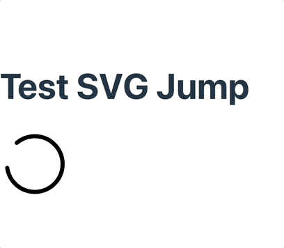

## 🎁 React + SVG 애니메이션 오픈소스 NPM 배포 가이드

지난 포스트에서는 다양한 SVG 애니메이션 컴포넌트(SvgJump, SvgFlip, SvgRotate)를 만들고 데모까지 구현해보았습니다. 이번 글에서는 이 라이브러리를 `npm`에 **정식 배포**하는 전체 과정을 하나씩 따라가며 정리합니다.

### ✅ 목표
- 기존 프로젝트에서 데모와 라이브러리 코드를 분리
- 새로운 라이브러리 전용 디렉토리(`svg-animate-lib`) 생성
- `package.json`, `tsconfig.json` 설정
- 빌드(`tsc`) 및 `dist/` 생성
- `npm publish`로 배포

---

## 📁 1. 디렉토리 구조 정리

우선 기존 `react-svg-animate` 프로젝트에서 라이브러리 부분만 분리합니다.

```bash
/my-project
├── demo/                # 기존 데모 프로젝트 (create-react-app 기반)
└── svg-animate-lib/     # 라이브러리만 포함된 배포용 프로젝트
```

---

## ⚙️ 2. `svg-animate-lib` 초기 세팅

### 2-1. TypeScript 프로젝트 생성
```bash
mkdir svg-animate-lib && cd svg-animate-lib
npm init -y
npm install --save-dev typescript
npx tsc --init
```

### 2-2. 디렉토리 구성
```bash
svg-animate-lib/
├── src/
│   └── components/
│       ├── SvgJump.tsx
│       ├── SvgFlip.tsx
│       └── SvgRotate.tsx
├── index.ts               # entry point
├── package.json
├── tsconfig.json
└── README.md
```

---

## 📦 3. `package.json` 설정

```json
{
  "name": "uryang-svg-animate",
  "version": "1.0.0",
  "main": "dist/index.js",
  "module": "dist/index.js",
  "types": "dist/index.d.ts",
  "files": ["dist"],
  "scripts": {
    "build": "tsc"
  },
  "license": "MIT",
  "peerDependencies": {
    "react": "^17.0.0 || ^18.0.0 || ^19.0.0",
    "react-dom": "^17.0.0 || ^18.0.0 || ^19.0.0",
    "gsap": "^3.12.0"
  },
  "dependencies": {
    "gsap": "^3.12.0"
  },
  "devDependencies": {
    "typescript": "^5.8.3",
    "@types/react": "^19.0.12",
    "@types/react-dom": "^19.0.4",
    "styled-components": "^6.1.16"
  }
}
```

- `peerDependencies`: 사용자가 설치해야 함 (react 등)
- `dependencies`: `gsap`은 기본 제공하도록 설정했음

---

## 🛠 4. `tsconfig.json` 설정

```json
{
  "compilerOptions": {
    "target": "ESNext",
    "module": "ESNext",
    "declaration": true,
    "outDir": "dist",
    "jsx": "react-jsx",
    "moduleResolution": "node",
    "esModuleInterop": true,
    "strict": true,
    "skipLibCheck": true
  },
  "include": ["src"]
}
```

> `declaration: true`는 `.d.ts` 타입 선언 파일 생성 필수!

---

## ✍️ 5. index.ts 작성

```ts
// src/index.ts
export { default as SvgFlip } from "./components/SvgFlip";
export { default as SvgJump } from "./components/SvgJump";
export { default as SvgRotate } from "./components/SvgRotate";
```

---
## 🖼 6. README.md 작성
내가 쓴 README 는 아래에서 확인 가능 !
https://www.npmjs.com/package/uryang-svg-animate?activeTab=readme 

---
## 🔨 7. 빌드 및 결과물 확인

```bash
npm run build
```

성공하면 `dist/` 디렉토리가 생성되고 `index.js`, `index.d.ts`가 포함되어야 합니다.

---

## 🪪 8. NPM 로그인

```bash
npm login
# 사용자명, 비밀번호, 2차 인증 코드 입력
```

> 아직 계정이 없다면 [npm 회원가입 페이지](https://www.npmjs.com/signup)에서 생성


---

## 🚀 9. NPM 배포

```bash
npm publish --access public
```

> `--access public`은 퍼블릭 공개 배포에 필수

### 이름 중복 확인
```bash
npm search uryang-svg-animate
# 이미 존재한다면 다른 이름으로 변경
```

---

## 9. ✅ 배포 후 테스트

```bash
npm install uryang-svg-animate gsap styled-components
```

### App.tsx(vite.js) 예시

```tsx
import CircleSvg from "./circle.svg?react";
import { SvgJump } from "uryang-svg-animate";

export default function App() {
  return (
    <div>
      <h1>Test SVG Jump</h1>
      <SvgJump
        svg={CircleSvg}
        trigger="click"
        type="stomp"
        duration={1}
        y={-150}
      />
    </div>
  );
}
```

### 테스트 성공!!!

---

## 📚 참고
- [GSAP 공식 문서](https://greensock.com/docs/)
- [NPM 배포 가이드](https://docs.npmjs.com/packages-and-modules)

---

## ✨ 마무리하며
- [내 첫 NPM](https://www.npmjs.com/package/uryang-svg-animate)

이번 프로젝트를 통해 처음으로 npm에 내가 만든 컴포넌트를 직접 배포해봤다.  
항상 다른 사람의 라이브러리를 설치해서 쓰기만 했는데,  
이제는 나도 무언가를 만들어서 공유할 수 있다는 사실이 꽤 뿌듯했다.

단순히 코드만 잘 짠다고 끝이 아니라는 걸 느꼈다.  
배포를 위해 디렉토리 구조를 나누고, 타입을 명확히 정의하고,  
사용자를 고려한 props 설계나 문서 작성까지 생각해야 했다.  
이 과정을 거치면서 리팩토링이나 유지보수, 버전 관리에 대해서도 자연스럽게 고민하게 됐다.

결국 좋은 코드는 재사용 가능한 구조와, 명확한 인터페이스, 그리고 남을 배려하는 문서에서 시작된다는 걸 배운 시간이었다.  
앞으로도 이런 작은 오픈소스를 하나씩 만들어보며 성장해보고 싶다.

> 다음엔 이걸 기반으로 Demo 사이트나 Storybook까지 붙여서 완성도를 더 높여보려 한다.


